# 🚀 employee_management_system
 
 
<h3>Login</h3>
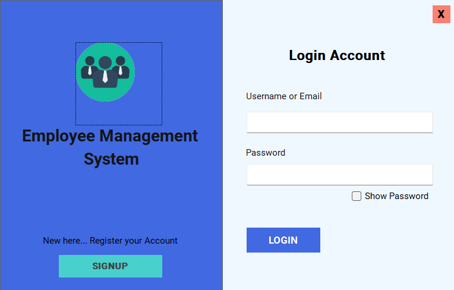
 
 
<h3>Create Account</h3>
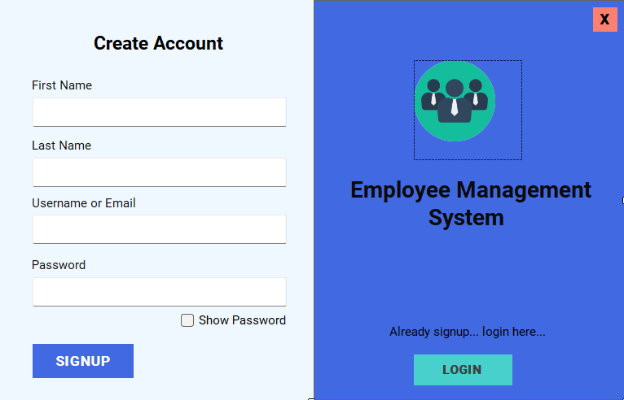
 
 
<h3>Dashboard</h3>
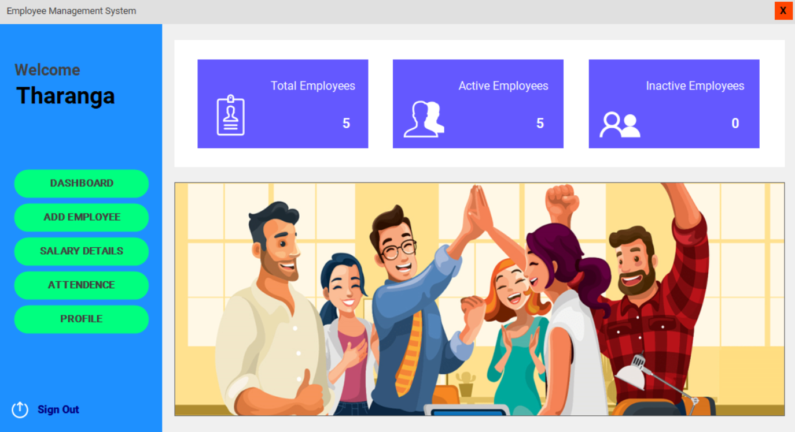
 
 
<h3>Add Employee</h3>
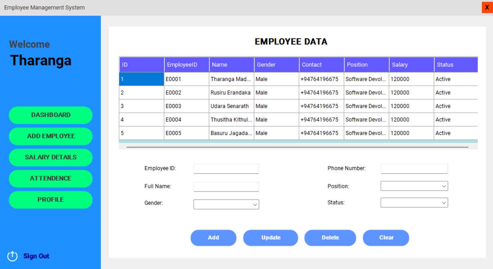
 
 
<h3>Job Role Info</h3>
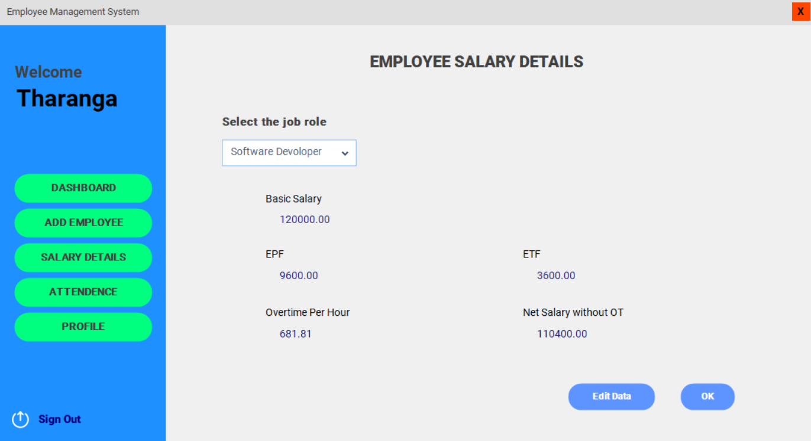
 
 
<h3>Profile</h3>
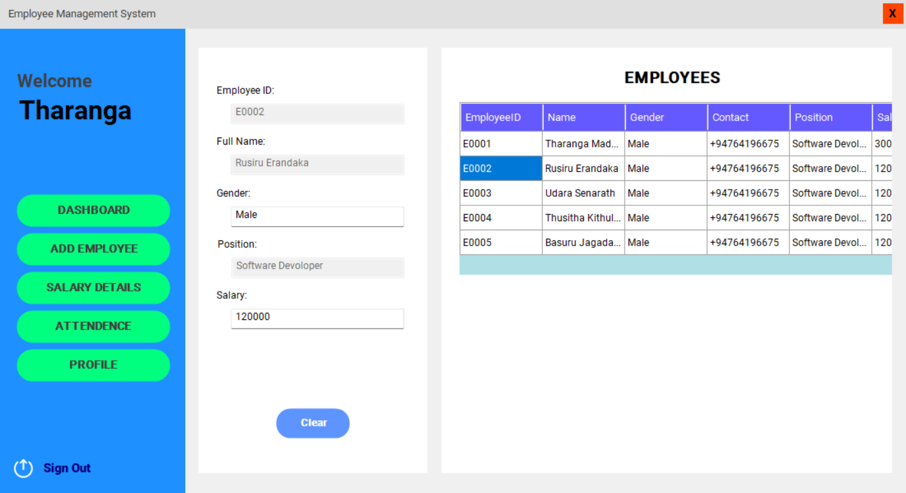
 
 
<h3>Tables</h3>
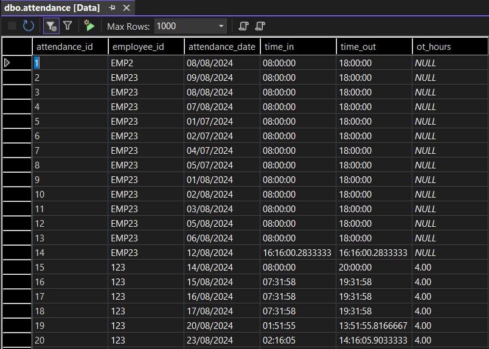
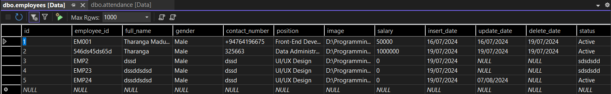
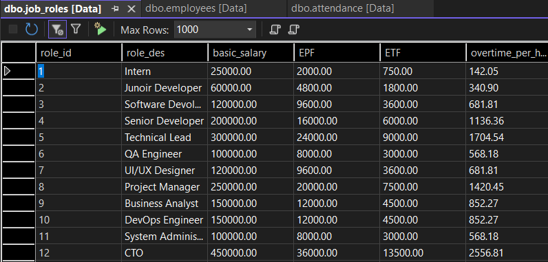
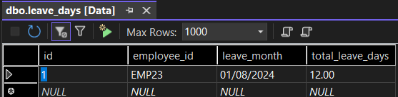
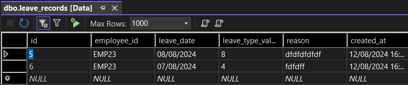
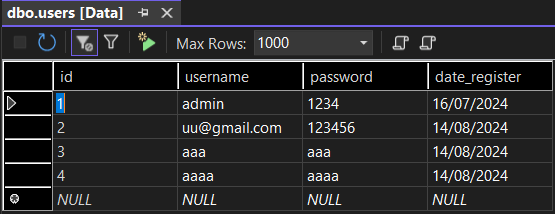
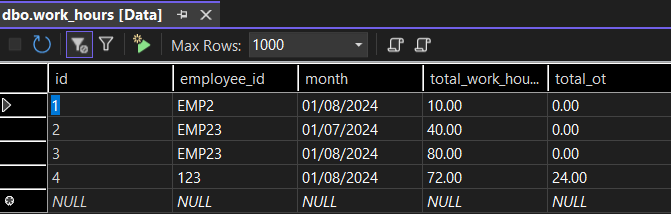
